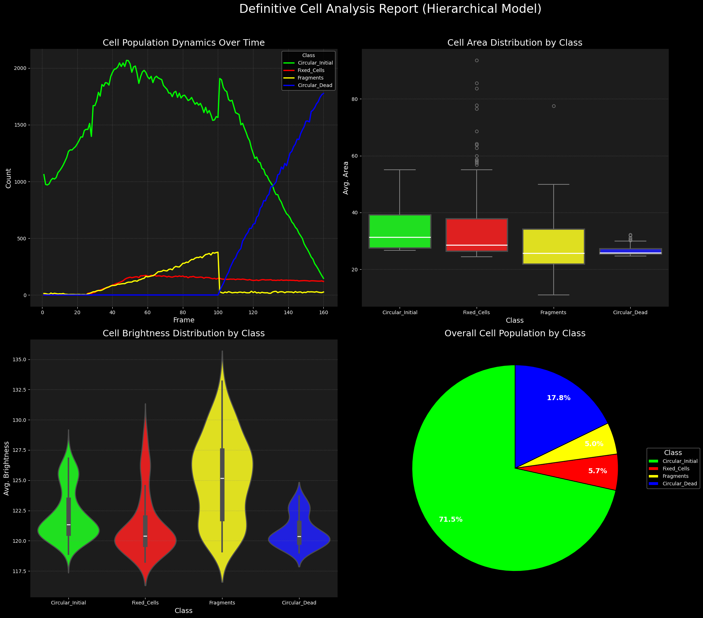

# HeLa Cell Tracking: A Deep Learning and State Machine Approach to Fixation Analysis



## Project Overview

This repository presents an advanced pipeline for tracking and analyzing HeLa cell behavior over time using deep learning and state machine methodologies. The primary objective is to classify cell states—**Circular**, **Fixed**, and **Dead**—based on temporal microscopy data, facilitating the study of cellular dynamics and responses to various treatments.

This project was also shared on [LinkedIn](https://www.linkedin.com/posts/shehab-hegab-5303491b7_computervision-python-bioinformatics-activity-7353284358998233088-Du3W?utm_source=share&utm_medium=member_desktop&rcm=ACoAADJrF7QBd9Oce1lYAjrVMkebIhqFwZLmCwk).

## Key Features

- **Deep Learning Segmentation**: Uses models like **Cellpose** and **SAM** for precise cell segmentation in time-lapse microscopy images.
- **Stateful Tracking**: Implements a state machine to model and predict transitions between cell states, enhancing tracking accuracy and biological relevance.
- **Data Analysis**: Provides statistical analysis tools such as survival rates and transition probabilities to interpret cell behavior.
- **Visualization**: Generates comprehensive reports and plots to aid in data interpretation and presentation.

## Project Highlights

- **Model Integration**: Combines advanced segmentation techniques with state machine logic to handle complex cell behaviors.
- **Biological Plausibility**: Incorporates rules to enforce biologically consistent state transitions, improving model reliability.
- **Reproducibility**: Ensures the pipeline can be replicated and adapted for similar datasets and research questions.

## Getting Started

### Prerequisites

- Python 3.8+
- Pip

### Installation

Clone the repository:

```bash
git clone https://github.com/Shehab-Hegab/HeLa-Cell-Tracking-A-Deep-Learning-and-State-Machine-Approach-to-Fixation-Analysis.git
cd HeLa-Cell-Tracking-A-Deep-Learning-and-State-Machine-Approach-to-Fixation-Analysis
